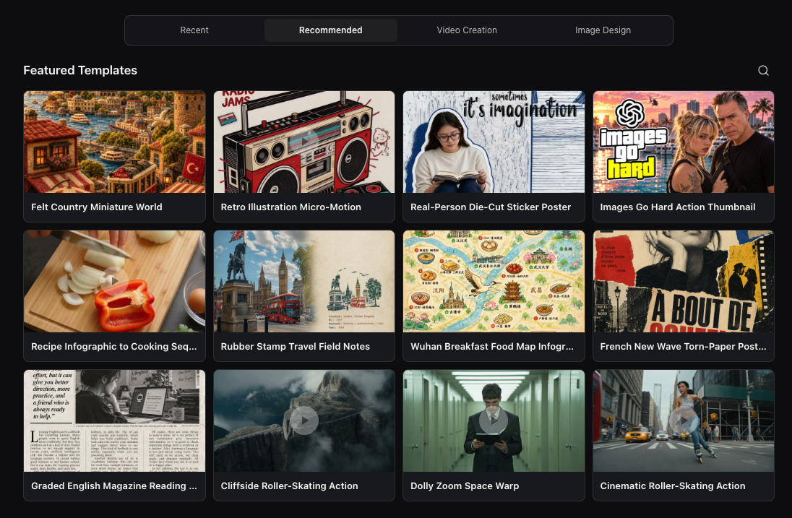
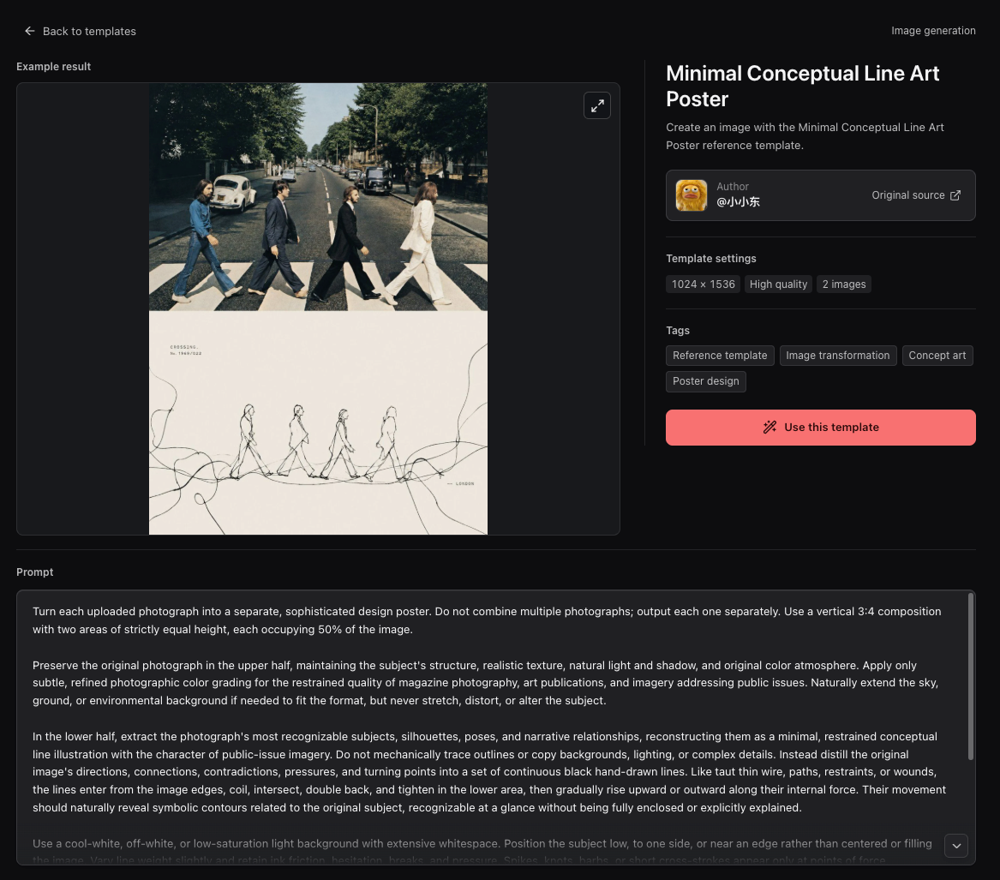
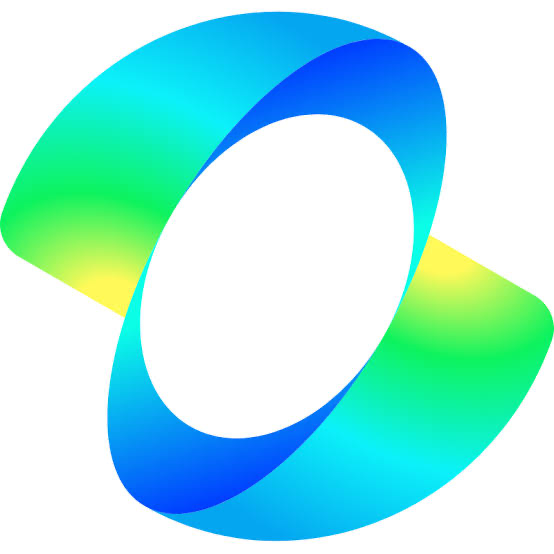
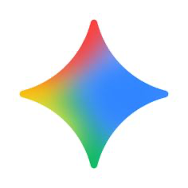
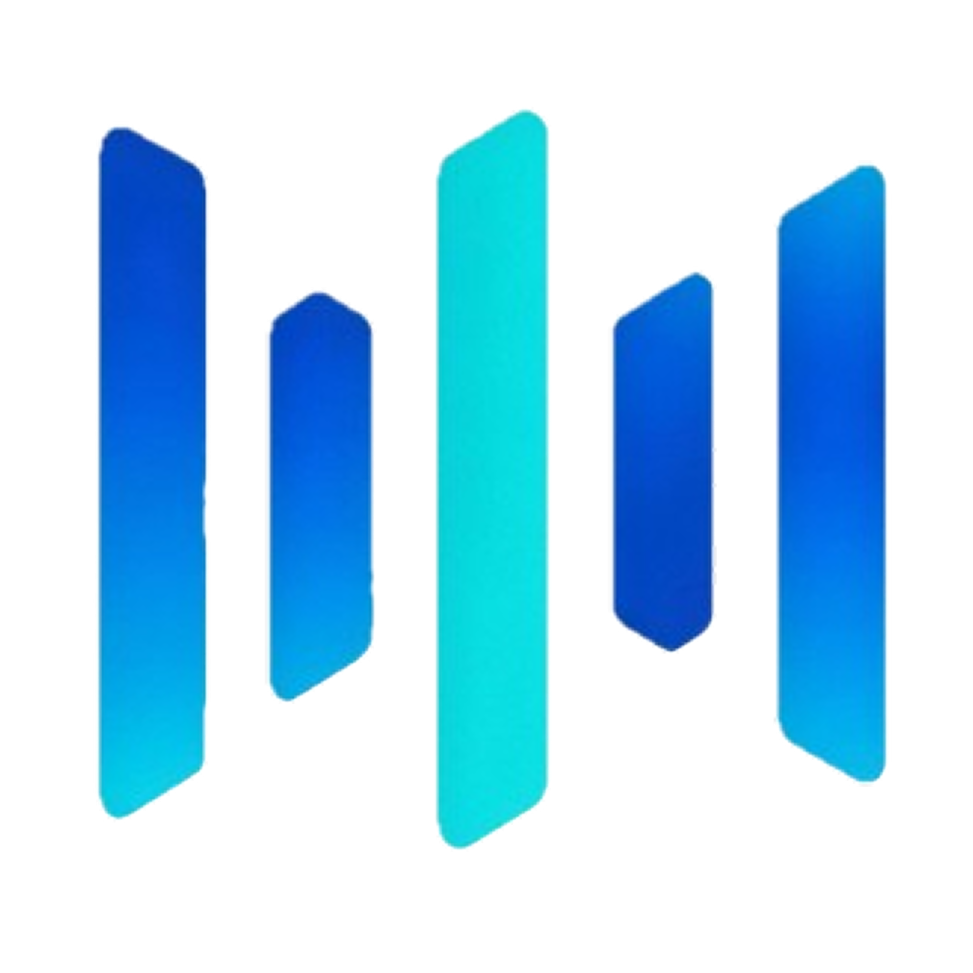
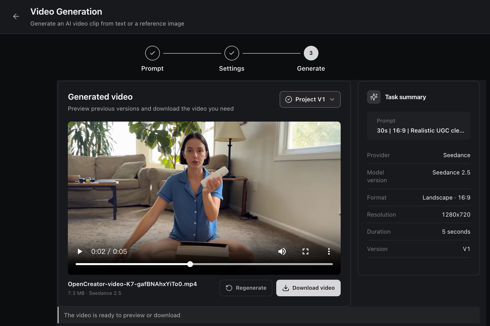
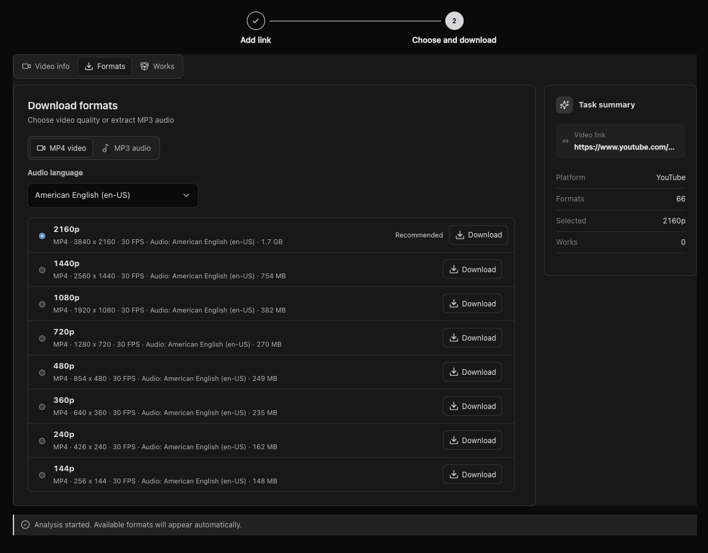
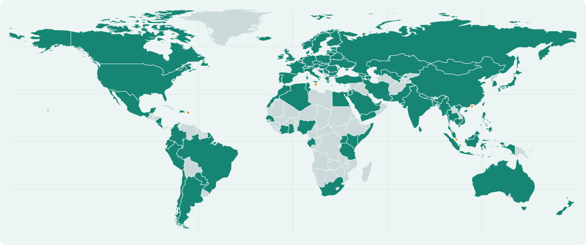

<div align="center">

<h1>
  <picture>
    <source media="(prefers-color-scheme: dark)" srcset="../images/OpenCreator_logo_vector_dark.svg" />
    
  </picture>
  <br />
  L'espace de travail IA open source & les Skills pour les créateurs
</h1>

<p>Réunissez outils de création visuels, Skills réutilisables et Agents pour les scripts, la vidéo, les images, la voix, les avatars, la traduction et le montage, dans un seul espace de travail.</p>

<p><strong>OpenCreator s'appelait auparavant KrillinAI.</strong></p>

<a href="https://trendshift.io/repositories/13360" target="_blank"></a>

[English](../../README.md) | [简体中文](../zh/README.md) | [日本語](../ja/README.md) | [한국어](../ko/README.md) | [Bahasa Indonesia](../id/README.md) | [Español](../es/README.md) | **Français** | [Deutsch](../de/README.md) | [Português](../pt/README.md) | [Русский](../ru/README.md) | [العربية](../ar/README.md)

[](https://github.com/krillinai/OpenCreator/stargazers)
[](https://www.apache.org/licenses/LICENSE-2.0)
[](https://space.bilibili.com/242124650)
[](https://atomgit.com/krillinai/OpenCreator)
[](https://discord.gg/3GwBGsjs8)
[](https://qm.qq.com/q/W4YC0PLMeA)

[Points forts](#points-forts) · [Outils](#outils-de-création) · [Skills](#skills) · [Exemples](#exemples) · [Démarrer](#démarrage-rapide) · [Desktop](#desktop) · [Docs](#documentation) · [Communauté](#communauté)

</div>


## Présentation du projet

OpenCreator s'adresse aux personnes et aux équipes qui souhaitent exécuter localement leurs activités créatives et de développement. Plutôt que de réimplémenter une boucle Agent, il utilise Codex CLI comme moteur d'exécution et lui ajoute un Runtime local stable, un espace de travail visuel et un hôte Desktop.

OpenCreator propose deux façons de travailler qui se complètent :

- **Espace de travail pour le contenu** : utilisez des outils visuels et des modèles de création pour traduire et télécharger des vidéos, générer des miniatures et des images, et réaliser d'autres créations.
- **Conversation avec l'Agent** : lancez et guidez des tâches créatives ou de développement en langage naturel, organisez les conversations par projet, laissez les Runs s'exécuter en arrière-plan et gérez les approbations, les pièces jointes, les fichiers, les Skills, MCP, les planifications, les notifications, la mémoire et les diagnostics depuis un seul endroit.

Web constitue l'unique implémentation du frontend. Desktop charge la même compilation Web et ajoute uniquement les capacités qui nécessitent le système d'exploitation, telles que la sélection de répertoires, le cycle de vie des fenêtres, le comportement de la zone de notification et les notifications natives. Avec les mêmes données et la même zone d'affichage du contenu, les deux plateformes partagent la même interface générale et le même comportement du Runtime.

## Points forts

- 🤖 **Natif Codex** : réutilisez la boucle Agent, les modèles, le raisonnement, les appels d'outils, les conversations, les Skills et MCP de Codex sans maintenir un second moteur d'exécution.

- 🚀 **Application Desktop prête à l'emploi** : lancez OpenCreator directement depuis l'application Desktop, qui inclut Codex CLI ; le Runtime local démarre à la demande et prépare automatiquement un projet par défaut.

- 🔄 **Composants Runtime gérés** : consultez les versions de yt-dlp incluse, active et la plus récente, vérifiez régulièrement les mises à jour et lancez-les manuellement, tout en conservant la version fonctionnelle si une mise à jour échoue.

- 🎨 **Création multimodale** : créez et gérez des vidéos, des images, de l'audio, des sous-titres et des documents dans un même flux de travail connecté.

- 🧩 **Modèles de création** : créez des images et des vidéos à partir de modèles réutilisables sans rédiger les prompts ni régler tous les paramètres de zéro.

- 🔗 **Flux de travail à deux modes** : travaillez dans l'espace de travail visuel ou dans une conversation avec l'Agent, tandis qu'une machine à états partagée synchronise les étapes, la progression et les résultats.

- 🕘 **Gestion des versions** : chaque révision crée une nouvelle version tout en conservant les réglages et les résultats précédents pour les consulter et les comparer.

- 🧩 **Skills réutilisables** : utilisez les Skills de production vidéo, enrichissez votre Agent avec vos propres Skills et gérez MCP via la configuration native de Codex.

- 🧠 **Mémoire** : conservez une mémoire globale, par projet et par fil, avec des résumés et des instantanés reproductibles des entrées de Run.

- 🔐 **Sécurité locale** : conservez les données, les pièces jointes et les journaux localement par défaut, avec des approbations et des diagnostics expurgés des informations sensibles.

## Outils de création

La version actuelle comprend six outils de création. Les modèles et services disponibles dépendent de votre environnement Codex local et de la configuration des services d'IA.

Ouvrez le Dashboard pour traduire ou télécharger des vidéos, générer des miniatures ou des images, créer des voix off avec le doublage intelligent ou générer des vidéos avec Seedance.


> De nouveaux outils de création sont ajoutés en continu.

<table width="100%">
<thead>
<tr>
<th width="18%">Outil</th>
<th width="14%">État</th>
<th width="68%">Fonctionnalités</th>
</tr>
</thead>
<tbody>
<tr><td valign="top">Traduction vidéo</td><td valign="top">✅ Disponible</td><td>Importez des vidéos locales ou publiques ; transcrivez-les avec des services Whisper locaux ou dans le cloud ; utilisez le contexte d'un LLM pour segmenter et aligner les sous-titres, gérer la terminologie et traduire ; configurez des sous-titres bilingues, un doublage ou un échantillon vocal personnalisé, le style des sous-titres et une composition horizontale ou verticale, puis exportez au format SRT, audio ou vidéo</td></tr>
<tr><td valign="top">Téléchargement de vidéos</td><td valign="top">✅ Disponible</td><td>Analysez des vidéos publiques individuelles de YouTube, Bilibili, X, TikTok, Instagram, Douyin, Facebook, Xiaohongshu et Pinterest ; comparez les formats disponibles et téléchargez la vidéo ou l'audio. Certaines plateformes peuvent nécessiter des cookies</td></tr>
<tr><td valign="top">Génération de miniatures</td><td valign="top">✅ Disponible</td><td>Combinez un sujet, un lien vidéo et une image de référence facultative pour générer et comparer plusieurs variantes de miniatures de contenu</td></tr>
<tr><td valign="top">Génération d'images</td><td valign="top">✅ Disponible</td><td>Générez des images avec GPT Image à partir d'un prompt et d'une image de référence facultative, configurez le format et le nombre de résultats, puis prévisualisez et téléchargez chaque image</td></tr>
<tr><td valign="top">Rédaction d’articles</td><td valign="top">✅ Disponible</td><td>Transformez un sujet, des liens, des vidéos ou des documents en choix de sujets, plan et article modifiables ; ajoutez des images et exportez en Markdown, HTML ou PDF.</td></tr>
<tr><td valign="top">Publications Xiaohongshu</td><td valign="top">✅ Disponible</td><td>Générez une publication à partir d’un sujet ou de sources en choisissant le public, le type et la longueur, puis copiez ou téléchargez le résultat.</td></tr>
<tr><td valign="top">Script de vidéo courte</td><td valign="top">✅ Disponible</td><td>Créez un script découpé prêt au tournage à partir d’un sujet ou de sources, adapté au public, à la plateforme, à la durée et au ton ; modifiez-le ou exportez-le.</td></tr>
<tr><td valign="top">Animation de bonshommes allumettes</td><td valign="top">✅ Disponible</td><td>Transformez du texte ou du contenu YouTube en narration, voix, images de storyboard aux personnages cohérents, sous-titres et animation téléchargeable.</td></tr>
<tr><td valign="top">Clips automatiques</td><td valign="top">En développement</td><td>Analysez de longues vidéos, identifiez les temps forts et transformez les moments choisis en clips courts réutilisables</td></tr>
<tr><td valign="top">Doublage intelligent</td><td valign="top">✅ Disponible</td><td>Transformez des scripts en voix off avec un choix de voix et des réglages de rythme et d'émotion</td></tr>
<tr><td valign="top">Génération vidéo</td><td valign="top">✅ Disponible</td><td>Générez des vidéos avec Seedance à partir de prompts et d'images de référence, puis prévisualisez, régénérez ou téléchargez chaque version</td></tr>
<tr><td valign="top">Avatar numérique</td><td valign="top">En développement</td><td>Combinez scripts, voix et présentation d'avatar pour produire des vidéos face caméra</td></tr>
</tbody>
</table>

## Modèles de création

Créez directement à partir d’un modèle, sans rédiger chaque prompt ni configurer chaque paramètre à partir de zéro. Parcourez les modèles mis en avant par catégorie, notamment pour la vidéo et le design d’images.

La collection réunit des modèles originaux d’OpenCreator et de créateurs indépendants. Pour les modèles tiers, la page de détail mentionne l’auteur et renvoie à la source d’origine.



Ouvrez un modèle pour voir un exemple de résultat et consulter son prompt, ses paramètres, ses tags, son auteur et sa source d’origine. Choisissez **Utiliser ce modèle** pour démarrer votre création, puis adaptez les éléments nécessaires.



## Skills

Les outils de création offrent des commandes visuelles ; les Skills fournissent à l'Agent des instructions et des workflows réutilisables. OpenCreator inclut des Skills de production vidéo dans le dépôt et permet de gérer les Skills locaux de Codex.

Le répertoire [`skills/`](../../skills/) du dépôt contient des instructions réutilisables pour les Agents qui utilisent la CLI KrillinAI intégrée.

| Skill | Fonctionnalités |
| --- | --- |
| [KrillinAI CLI](../../skills/krillinai-cli/SKILL.md) | Choisir les commandes, vérifier la configuration et interpréter la progression, les manifestes, les sorties et les erreurs |
| [Sous-titres](../../skills/krillinai-subtitle/SKILL.md) | Télécharger les sous-titres des plateformes ou transcrire les médias, traduire les sous-titres et produire des sous-titres bilingues ou courts pour les vidéos verticales |
| [TTS](../../skills/krillinai-tts/SKILL.md) | Générer un doublage dans la langue cible à partir de sous-titres et, si nécessaire, produire une vidéo doublée |
| [Rendu paysage](../../skills/krillinai-render-horizontal/SKILL.md) | Produire des vidéos au format paysage avec des sous-titres bilingues ou un audio doublé et des sous-titres dans la langue cible |
| [Rendu portrait](../../skills/krillinai-render-vertical/SKILL.md) | Composer des vidéos verticales avec des titres, des sous-titres bilingues ou un doublage |
| [Couverture](../../skills/krillinai-cover/SKILL.md) | Générer une image de couverture à partir d’un prompt textuel complet et enregistrer l’image et le prompt final |
| [Planification du pipeline](../../skills/krillinai-pipeline/SKILL.md) | Valider un plan de sorties en plusieurs étapes en mode dry-run ; exécuter le travail réel avec les Skills de chaque étape |

### Ajoutez vos propres Skills

OpenCreator prend en charge les Skills locaux de Codex définis par `SKILL.md`, pour ajouter vos propres méthodes et workflows sans vous limiter aux outils de création prédéfinis. Leur disponibilité dépend du Codex home actif et des Skills installés ; les Skills vidéo nécessitent la configuration de la CLI et des services concernés. La présence d’un Skill dans le dépôt ne signifie pas qu’il est installé automatiquement ni que tous les services externes sont inclus.

## Conversation et espace de travail avancent ensemble

Décrivez naturellement vos tâches, puis passez aux outils visuels dès que vous avez besoin d'un contrôle précis.

Les fournisseurs et modèles présentés sont des exemples ; leur disponibilité dépend des identifiants, des droits du compte et de la plateforme.

### Contrôles précis de l'espace de travail

Ajustez avec précision les sous-titres, les plans, l'audio et les paramètres de génération.

### Modifications conversationnelles flexibles

Indiquez à l'Agent ce qu'il doit modifier et affinez le résultat en langage naturel.

### État synchronisé

La conversation et l'espace de travail partagent l'état de la tâche en cours, sans avoir à répéter les informations.

### Versions indépendantes

Chaque révision crée une version distincte sans écraser les résultats ni les paramètres précédents.

## Modèles pris en charge

La disponibilité des modèles de langage suit le catalogue de modèles Codex ou votre fournisseur compatible avec OpenAI. Les modèles d'image, de vidéo, de voix et de transcription utilisent les services configurés dans **Paramètres → Services d'IA**.

Les tableaux présentent les fournisseurs préconfigurés et les modèles recommandés ; leur disponibilité dépend des identifiants, des droits du compte et de la plateforme.

### Modèles de langage

<table>
<tr>
<td align="center" width="20%"><br /><strong>GPT</strong></td>
<td align="center" width="20%"><br /><strong>DeepSeek</strong></td>
<td align="center" width="20%"><br /><strong>Qwen</strong></td>
<td align="center" width="20%"><br /><strong>Kimi</strong></td>
<td align="center" width="20%"><br /><strong>GLM</strong></td>
</tr>
<tr>
<td align="center" width="20%"><br /><strong>Grok</strong></td>
<td align="center" width="20%"><br /><strong>Doubao</strong></td>
<td align="center" width="20%"><br /><strong>ERNIE</strong></td>
<td align="center" width="20%"><br /><strong>Hunyuan</strong></td>
<td align="center" width="20%"><br /><strong>MiniMax</strong></td>
</tr>
</table>

### Image

<table>
<tr>
<td align="center" width="25%"><br /><strong>GPT Image</strong></td>
<td align="center" width="25%"><br /><strong>Seedream 4.0</strong><br />Jimeng</td>
<td align="center" width="25%"><br /><strong>Kling v2.1</strong><br />Kling Image</td>
<td align="center" width="25%"><br /><strong>Nano Banana</strong><br />Gemini 2.5 Flash Image</td>
</tr>
</table>

### Vidéo

<table>
<tr>
<td align="center" width="33%"><br /><strong>Seedance 2.5</strong></td>
<td align="center" width="33%"><br /><strong>Kling v2.1 Master</strong></td>
<td align="center" width="33%"><br /><strong>Veo 3.1</strong></td>
</tr>
</table>

### Voix et transcription

<table>
<tr>
<td align="center" width="20%"><br /><strong>Whisper</strong></td>
<td align="center" width="20%"><br /><strong>OpenAI TTS</strong></td>
<td align="center" width="20%"><br /><strong>MiniMax</strong></td>
<td align="center" width="20%"><br /><strong>Edge TTS</strong></td>
<td align="center" width="20%"><br /><strong>Aliyun Speech</strong></td>
</tr>
</table>

La transcription locale prend également en charge faster-whisper, WhisperKit et whisper.cpp sur les plateformes compatibles.

## Exemples

### Traduction vidéo

Les exemples publics ci-dessous ont été produits lorsqu'OpenCreator portait encore le nom de KrillinAI. Ils illustrent le flux de travail éprouvé d'alignement des sous-titres, de traduction, de doublage et de vidéo verticale que l'espace de Traduction vidéo d'OpenCreator intègre à un flux Agent plus large.

Le projet a généré le fichier de sous-titres ci-dessous à partir d'une vidéo locale de 46 minutes en une seule exécution, sans aucun ajustement manuel. Le résultat publié couvre l'intégralité de la vidéo, sans lignes qui se chevauchent, avec une segmentation naturelle et une traduction de grande qualité.


<table width="100%">
<tr>
<td width="33%">

#### Traduction des sous-titres

https://github.com/user-attachments/assets/bba1ac0a-fe6b-4947-b58d-ba99306d0339

</td>
<td width="33%">

#### Doublage

https://github.com/user-attachments/assets/0b32fad3-c3ad-4b6a-abf0-0865f0dd2385

</td>
<td width="33%">

#### Mode vertical

https://github.com/user-attachments/assets/c2c7b528-0ef8-4ba9-b8ac-f9f92f6d4e71

</td>
</tr>
</table>

> Ces exemples vidéo et l'image d'alignement des sous-titres ont été produits lorsqu'OpenCreator utilisait encore le nom KrillinAI.

### Génération vidéo

Générez une vidéo par IA à partir d'un prompt textuel ou d'une image de référence avec Seedance. Configurez le modèle, le format, la résolution et la durée, puis prévisualisez, régénérez ou téléchargez chaque version depuis l'espace de travail du projet.



### Téléchargement de vidéos

Analysez un lien vidéo public, comparez les formats disponibles, puis téléchargez la vidéo ou l'audio directement dans le projet.

Sources vidéo prises en charge :

<table align="center">
  <tr>
    <td align="center" width="96"><br /><strong>YouTube</strong></td>
    <td align="center" width="96"><br /><strong>Bilibili</strong></td>
    <td align="center" width="96"><br /><strong>X</strong></td>
    <td align="center" width="96"><br /><strong>TikTok</strong></td>
    <td align="center" width="96"><br /><strong>Instagram</strong></td>
    <td align="center" width="96"><br /><strong>Douyin</strong></td>
    <td align="center" width="96"><br /><strong>Facebook</strong></td>
    <td align="center" width="96"><br /><strong>Xiaohongshu</strong></td>
    <td align="center" width="96"><br /><strong>Pinterest</strong></td>
  </tr>
</table>

La disponibilité dépend de la vidéo et de la région ; certaines sources peuvent nécessiter des cookies de la plateforme. OpenCreator n'importe pas automatiquement les cookies du navigateur.

**Publications vidéo Xiaohongshu :** Collez l'URL publique complète `https://www.xiaohongshu.com/explore/<identifiant hexadécimal de 24 caractères>`, en conservant les paramètres comme `xsec_token`. Les publications contenant uniquement des images n'ont pas de formats vidéo ; les profils et les liens courts `xhslink.com` ne sont pas pris en charge. Un jeton expiré ou des restrictions d'accès peuvent empêcher le téléchargement.

**Épingles vidéo Pinterest :** Collez un lien public `https://www.pinterest.com/pin/<identifiant numérique>/`. Les épingles contenant uniquement des images, les tableaux et les profils ne sont pas pris en charge.



### Animation de bonshommes allumettes

OpenCreator a développé cette collection de personnages originaux avec l’artiste [Harbor Hsia](https://www.behance.net/xiaheyuan1), créateur de [Stickman sur Behance](https://www.behance.net/gallery/254715463/Stickman). Les personnages intégrés conservent une identité cohérente tout au long de la création.


Transformez du texte ou du contenu YouTube en animation grâce à la révision du scénario, la narration, le minutage, le storyboard, les sous-titres, le rendu et le téléchargement de la vidéo.


## Démarrage rapide

### Installer l’application Desktop

Téléchargez l’installateur macOS Apple Silicon, macOS Intel ou Windows x64 depuis la [dernière version](https://github.com/krillinai/OpenCreator/releases/latest). Desktop ne nécessite ni Node.js ni pnpm et inclut Codex CLI. Les tâches utilisant un modèle exigent une connexion Codex valide.

Au premier lancement, le Runtime local démarre et un projet par défaut est préparé. Une fois connecté, saisissez une demande pour lancer une tâche. En cas de problème, consultez le [guide utilisateur](../opencreator-user-guide-and-troubleshooting.md).

### Exécuter Web depuis le code source

Pour développer ou utiliser Web depuis les sources, préparez :

- Node.js 22 ou version ultérieure
- pnpm 9.15.0, épinglé dans le champ `packageManager` du dépôt
- Un exécutable Codex CLI disponible dans votre terminal
- Une connexion Codex CLI valide pour les tâches faisant appel à de vrais modèles

Vérifiez d'abord votre environnement local :

```bash
node --version
pnpm --version
codex --version
```

```bash
git clone https://github.com/krillinai/OpenCreator.git
cd OpenCreator
corepack enable
pnpm install
pnpm web:dev
```

Ouvrez `http://127.0.0.1:19861/`. Le serveur de développement démarre le daemon local à la demande et injecte un jeton Runtime temporaire au moyen d'un proxy de même origine ; aucun jeton de connexion ne doit donc être copié manuellement.

Au premier lancement, le Runtime prépare un projet par défaut. La zone de saisie est disponible dès que la connexion est établie. Pour travailler uniquement sur le daemon :

```bash
pnpm daemon:dev
```

Le daemon écoute uniquement sur une adresse de bouclage et affiche une seule fois son adresse de connexion et son jeton temporaire dans stdout.

## Desktop

Desktop et le navigateur utilisent le même frontend React depuis `apps/web`. Les comportements généraux relatifs aux projets, aux conversations, aux tâches et aux réglages appellent les mêmes Daemon/API. Electron ajoute uniquement les chemins système réels, les commandes de fenêtre, le comportement de la zone de notification et les notifications natives.

### Mode développement

```bash
pnpm desktop:dev
```

### Empaquetage local

| Commande | Résultat |
| --- | --- |
| `pnpm desktop:package` | Un répertoire exécutable pour la plateforme actuelle, destiné à la vérification locale |
| `pnpm desktop:dist` | Un programme d'installation pour la plateforme actuelle |
| `pnpm desktop:release` | Le point d'entrée de l'empaquetage pour une version officielle |
| `pnpm --filter @opencreator/desktop verify:package` | Vérification d'un paquet Desktop existant |

L'empaquetage Desktop reconstruit Web depuis l'espace de travail actuel, enregistre le commit, l'état dirty, la plateforme, l'architecture et le hash Web, puis compare `apps/web/dist` avec les ressources intégrées à l'application. L'empaquetage échoue en cas de différence. Consultez le [guide opérationnel des versions Desktop](../operations/opencreator-desktop-release-runbook.md) pour la signature, la notarisation, les builds Windows et les exigences de publication.

## Flux de travail principaux

### Conversations et Runs

1. Sélectionnez un projet ou démarrez une nouvelle conversation.
2. Saisissez une tâche et choisissez le niveau d'autorisation, le Profile, le modèle et l'effort de raisonnement.
3. Lorsqu'un Run est actif, mettez les tâches de suivi en file d'attente ou interrompez-le pour poursuivre immédiatement.
4. Utilisez la Timeline pour consulter les résumés du raisonnement, les appels d'outils, les modifications de fichiers, les approbations et les résultats finaux.
5. Utilisez le centre de tâches pour suivre globalement les tâches en cours, terminées, échouées et bloquées par une approbation.

### Skills et MCP

- Parcourez la marketplace des Skills, l'historique d'installation et les Skills disponibles localement dans le centre de plugins.
- Sélectionnez une Skill depuis la zone de saisie avec `/` ou le menu d'ajout afin que la tâche suivante suive son flux de travail.
- La gestion de MCP passe par les commandes et la configuration natives de Codex plutôt que par la maintenance d'un second moteur d'exécution.
- OpenCreator utilise le `$CODEX_HOME` actif par défaut ; vérifiez donc l'impact avant de modifier la configuration globale des Skills ou de MCP.

### Planifications et fils de tâches dédiés

- Chaque planification possède une conversation OpenCreator persistante et dédiée.
- Les déclenchements automatiques, les exécutions manuelles et les demandes de suivi de l'utilisateur réutilisent cette conversation et s'exécutent en série selon la politique `queue` ou `skip`.
- La suppression d'une planification archive sa conversation dédiée tout en préservant les Runs, les résultats et l'historique Codex sous-jacent.
- La rotation ou la récupération d'un fil Codex sous-jacent ne modifie ni l'entrée de tâche ni la route de page d'OpenCreator.

## Structure du système OpenCreator

OpenCreator considère l'espace de travail visuel et la conversation avec l'Agent comme deux interfaces d'une même tâche créative, et non comme deux flux de travail distincts. Chaque flux de création est modélisé comme une machine à états : l'entrée source, la configuration, la génération, la révision, la modification et l'exportation deviennent des états et des événements explicites. Les actions de l'espace de travail et les commandes conversationnelles entrent dans la même machine à états, tandis que l'étape en cours, la configuration, la progression, les versions et les résultats sont projetés dans les deux interfaces. L'espace de travail et la conversation restent ainsi synchronisés sans introduire une seconde source de vérité.

Le travail créatif est itératif, les révisions n'écrasent donc pas le résultat actuel. Chaque correction ou régénération crée une nouvelle version à partir de l'état existant du flux de travail et conserve les réglages et les résultats des versions précédentes pour permettre leur consultation, leur comparaison et la poursuite des améliorations.

```text
+-----------------------------+     +------------------------------------+
| Browser Access              |     | Desktop Host                       |
|                             |     | Shared Web build + Electron        |
+--------------+--------------+     +------------------+-----------------+
               |                                       |
               +-------------------+-------------------+
                                   v
+----------------------------------------------------------------------------+
| Creator Experience / apps/web                                              |
| Dashboard / Creator Tools / Agent Conversation / Settings / Files          |
+-------------------------------------+--------------------------------------+
                                      |
+-------------------------------------v--------------------------------------+
| Collaboration Core                                                         |
| Shared workflow state / Steps / Progress / Results / Versions              |
+-------------------------------------+--------------------------------------+
                                      | Runtime API + SSE
+-------------------------------------v--------------------------------------+
| Local Runtime / apps/daemon                                                 |
| Projects / Runs / Approvals / Schedules / Memory / Notifications           |
| Component status / Update checks / Verified updates / Safe fallback        |
+-------------+------------------------+------------------------+-------------+
              |                        |                        |
              v                        v                        v
+---------------------+  +---------------------+  +-------------------------+
| Local Data          |  | Codex Engine        |  | Media Toolchain         |
| SQLite / Files      |  | CLI / app-server    |  | FFmpeg / yt-dlp         |
| System credentials  |  | Skills / MCP        |  | Whisper / AI services   |
+---------------------+  +---------------------+  +-------------------------+
```

| Composant OpenCreator | Responsabilité | Implémentation |
| --- | --- | --- |
| Expérience de création | Dashboard, outils de création, conversation Agent, paramètres et fichiers | `apps/web` · React 18 · Vite · TypeScript |
| Cœur de collaboration | Synchronise les étapes de l'espace de travail, le contexte de conversation, la progression, les résultats et les révisions | État de flux partagé · `CreatorCollaborationPanel` · historique des versions |
| Runtime local | Gère les projets, Runs, approbations, planifications, mémoire et notifications | `apps/daemon` · Fastify · Runtime API · SSE |
| Composants Runtime | Suit les versions incluse, active et la plus récente, vérifie périodiquement et n'installe que les mises à jour demandées | yt-dlp nightly · vérification des mises à jour · repli vers la version fonctionnelle |
| Moteur Codex | Fournit la boucle Agent, les sessions, le raisonnement, les outils, les Skills et MCP | Codex CLI · app-server |
| Chaîne d'outils multimédias | Télécharge, transcrit, transforme, génère et exporte les médias créatifs | yt-dlp · Whisper · FFmpeg · services d'IA configurés |
| Données locales | Stocke localement les données de projet, Runs, pièces jointes, résultats et identifiants | SQLite · système de fichiers · stockage des identifiants système |
| Hôte Desktop | Charge la compilation Web partagée et ajoute les capacités du système d'exploitation | `apps/desktop` · Electron · Preload Bridge |

Principes fondamentaux :

- L'espace de travail et la conversation avec l'Agent sont des projections synchronisées du même état de flux ; tous deux envoient des événements à la même machine à états au lieu de maintenir des états de tâches parallèles.
- Les révisions créent de nouvelles versions au lieu de remplacer les résultats existants, ce qui préserve le contexte et le résultat de chaque itération créative.
- Le frontend ne lance pas Codex directement et ne dépend pas du format brut des événements JSONL de Codex.
- Le daemon gère le cycle de vie des processus, la normalisation des événements, la persistance, les approbations, les planifications et la boîte d'envoi des notifications.
- Codex reste la source de vérité pour l'exécution de la boucle Agent, des Skills et de MCP.
- Browser Bridge et Desktop Bridge n'implémentent pas de copies séparées de la logique générale du produit.

## Organisation du dépôt

```text
OpenCreator/
├── apps/
│   ├── web/          # L'unique implémentation du frontend React
│   ├── daemon/       # Runtime Fastify local et adaptateur Codex
│   ├── desktop/      # Electron Main, Preload, capacités natives et empaquetage
│   └── harness/      # Outil de vérification du Runtime en ligne de commande
├── packages/
│   ├── protocol/     # Contrats Runtime partagés par Web, Daemon et Desktop
│   └── skill-market/ # Modèles de marketplace des Skills et logique partagée
├── docs/             # Documents de conception, références API, guides opérationnels et rapports de tests
├── scripts/          # Vérifications à l'échelle du dépôt
└── .runtime/         # Données Runtime locales, créées au premier lancement
```

## Configuration

### Clés API des services d'IA

Ouvrez **Paramètres → Services d'IA** pour configurer les fournisseurs de modèles, de transcription, d'audio et d'images utilisés par les espaces de travail actuels. D'autres catégories de services peuvent apparaître en prévision des prochains outils de création. Chaque catégorie affiche uniquement les champs requis par le fournisseur sélectionné, notamment la Base URL, l'API Key, le modèle, le proxy ou les identifiants propres au fournisseur.


Les identifiants sont enregistrés dans le stockage système des identifiants du Runtime local et ne doivent jamais être commités dans le dépôt. Certains fournisseurs locaux ou intégrés au système, tels qu'Edge TTS, ne nécessitent pas d'API Key.

### Composants Runtime tiers

Ouvrez **Paramètres → Composants tiers** pour consulter la version nightly de yt-dlp actuellement utilisée, la version incluse avec OpenCreator, sa source et la dernière version disponible. OpenCreator vérifie les mises à jour tous les sept jours, mais ne les installe jamais automatiquement. Une action explicite de l'utilisateur est nécessaire, et la version fonctionnelle actuelle reste disponible si le téléchargement, la vérification ou l'installation échoue.


### Variables d'environnement du Runtime

La plupart des utilisateurs n'ont pas besoin de variables d'environnement. Utilisez-les si vous avez besoin de données isolées, d'un exécutable Codex particulier ou d'un répertoire personnalisé pour les projets gérés :

| Variable d'environnement | Valeur par défaut | Rôle |
| --- | --- | --- |
| `OPENCREATOR_DATA_DIR` | `.runtime` | Base de données OpenCreator, Runs, pièces jointes et espaces de travail gérés |
| `OPENCREATOR_CODEX_BIN` | `codex` | Chemin vers l'exécutable Codex CLI |
| `CODEX_HOME` | `~/.codex` | Source de vérité pour les sessions, la configuration, les Skills, MCP et les Profiles Codex |
| `OPENCREATOR_DEFAULT_CWD` | Répertoire de travail actuel | Répertoire de travail par défaut du daemon |
| `OPENCREATOR_DEFAULT_PROJECT_ROOT` | Politique par défaut du Runtime | Racine des projets gérés ; lorsqu'elle est définie, OpenCreator utilise son sous-répertoire `OpenCreator/` |
| `OPENCREATOR_CODEX_THREAD_ROTATION_RUN_THRESHOLD` | `50` | Seuil de Runs terminés pour faire tourner le fil Codex associé à une planification de longue durée ; utilisez `0` pour désactiver la rotation proactive |

Par exemple, pour isoler à la fois les données du Runtime et l'environnement Codex :

```bash
OPENCREATOR_DATA_DIR=/path/to/opencreator-data \
CODEX_HOME=/path/to/codex-home \
pnpm web:dev
```

## Données et sécurité

Les données du Runtime sont stockées par défaut sous `.runtime/` à la racine du dépôt :

| Chemin | Contenu |
| --- | --- |
| `.runtime/app.sqlite` | Projets, fils, Runs, événements, planifications, notifications, métadonnées des pièces jointes, approbations, mémoire et résumés |
| `.runtime/runs/` | Journaux expurgés, diagnostics et métadonnées des différents Runs |
| `.runtime/attachments/` | Fichiers joints contrôlés |
| `.runtime/workspaces/` | Espaces de travail de projets gérés par le Runtime |

Les sessions et la configuration Codex restent dans `$CODEX_HOME` et doivent être sauvegardées séparément de `.runtime/`.

Les limites de sécurité comprennent :

- Le daemon écoute uniquement sur `127.0.0.1` ; toutes les API, à l'exception du contrôle d'intégrité, nécessitent un jeton Bearer.
- L'aperçu HTML désactive par défaut les scripts, la navigation et les fenêtres contextuelles, et n'autorise que les ressources relatives contrôlées du même espace de travail.
- La mémoire sensible nécessite une seconde confirmation. OpenCreator ne stocke jamais automatiquement et définitivement les suggestions non confirmées.
- Les diagnostics et les journaux de Runs sont expurgés avant d'être renvoyés ou exportés.
- Les paquets Desktop activent l'intégrité ASAR et le chiffrement des cookies, tout en désactivant RunAsNode, `NODE_OPTIONS` et Node CLI Inspector.

Consultez le [guide de l'utilisateur et de dépannage](../opencreator-user-guide-and-troubleshooting.md) pour connaître l'intégralité des procédures de sauvegarde, de restauration, de nettoyage et de réinitialisation.

## Développement

### Commandes courantes

| Commande | Rôle |
| --- | --- |
| `pnpm web:dev` | Démarrer Web et lancer le daemon local à la demande |
| `pnpm daemon:dev` | Démarrer uniquement le daemon |
| `pnpm desktop:dev` | Compiler les dépendances et démarrer Electron en mode développement |
| `pnpm test` | Exécuter les tests unitaires et d'intégration des workspaces |
| `pnpm typecheck` | Exécuter les vérifications TypeScript dans tout le dépôt |
| `pnpm build` | Compiler tous les workspaces |
| `pnpm e2e` | Exécuter les tests E2E Playwright de Web |
| `pnpm smoke:ci` | Exécuter le test de fumée du Runtime avec un faux Codex |
| `pnpm perf:check` | Vérifier la référence de performance enregistrée |

Avant de soumettre une modification, choisissez les vérifications adaptées à son impact selon le [guide de contribution](../../CONTRIBUTING.md#what-reviewers-check). Les changements de documentation, de texte et de style demandent seulement des contrôles ciblés ; le comportement partagé et Runtime exigent des tests ciblés et une vérification de types. N’exécutez les tests ou builds complets que si nécessaire et indiquez les vérifications effectuées dans la PR.

Les modifications apportées à Desktop, à Host Bridge, au proxy du Runtime ou aux flux frontend partagés nécessitent également des tests de cohérence Web/Desktop, des tests E2E de l'application empaquetée et une vérification du hash de la compilation Web. La réussite des seuls tests unitaires Web ne suffit pas à établir qu'une version Desktop est prête à être publiée.

Le test de fumée avec le véritable Codex est désactivé par défaut. Activez-le explicitement avec :

```bash
OPENCREATOR_RUN_REAL_CODEX_SMOKE=1 \
pnpm --filter @opencreator/daemon test -- test/smoke/real-codex-smoke.test.ts
```

## Documentation

- **Utiliser OpenCreator:** [Démarrage rapide](#démarrage-rapide) · [Guide de l'utilisateur et de dépannage](../opencreator-user-guide-and-troubleshooting.md)
- **Développer et étendre:** [Guide de contribution](../../CONTRIBUTING.md) · [Contribuer à un Skill](../contributing/skills-contributing.md) · [Contribuer à un modèle de création](../contributing/templates-contributing.md) · [Runtime API v1](../runtime-api-for-ui-v1.md) · [Directives relatives aux composants visuels](../visual-component-guidelines.md)
- **Maintenir et publier:** [Conception du Runtime natif Codex](../2026-07-03-codex-native-agent-runtime-design.md) · [Guide opérationnel des versions Desktop](../operations/opencreator-desktop-release-runbook.md) · [Guide des versions Desktop pour Windows](../operations/opencreator-desktop-windows-release.md)

## Convention de traduction

Le fichier `README.md` situé à la racine est le document anglais de référence. Les traductions maintenues se trouvent dans `docs/<locale>/README.md`. N'ajoutez une langue au sélecteur qu'une fois l'intégralité du document traduite et synchronisée avec la structure anglaise.

## Communauté

<p>OpenCreator a reçu des étoiles d’utilisateurs GitHub dans <strong>au moins 99 pays et régions</strong>.</p>



### L’équipe

Chaque membre est responsable des règles, de la revue et de la fusion des contributions et du soutien à la communauté dans son domaine.

<table border="1" cellpadding="12">
  <tr>
    <td align="center" valign="middle" width="160" height="160"><br /><a href="https://github.com/wulien">wulien</a><br />Code et corrections de bugs</td>
    <td align="center" valign="middle" width="160" height="160"><br /><a href="https://github.com/DLe-kb">DLe-kb</a><br />Modèles de création</td>
    <td align="center" valign="middle" width="160" height="160"><br /><a href="https://github.com/xiaheyuan">xiaheyuan</a><br />Design et ressources</td>
    <td align="center" valign="middle" width="160" height="160"><br /><a href="https://github.com/krillinai">krillinai</a><br />Skills et documentation</td>
  </tr>
</table>

### Contributeurs

Merci à toutes les personnes qui ont contribué par le code, la documentation, les retours, les rapports de problèmes, les Skills, les conceptions et les idées.

<div>
  <a href="https://github.com/maranello-o"></a>
  <a href="https://github.com/wulien"></a>
  <a href="https://github.com/puji4810"></a>
  <a href="https://github.com/krillinai"></a>
  <a href="https://github.com/PairZhu"></a>
  <a href="https://github.com/Mijaelx"></a>
  <a href="https://github.com/OutisLi"></a>
  <a href="https://github.com/yeager"></a>
  <a href="https://github.com/catwithtudou"></a>
  <a href="https://github.com/newdee"></a>
  <a href="https://github.com/scwf"></a>
  <a href="https://github.com/xiaheyuan"></a>
  <a href="https://github.com/hbxugang"></a>
  <a href="https://github.com/kapil971390"></a>
  <a href="https://github.com/octo-patch"></a>
  <a href="https://github.com/yuanjinghh"></a>
  <a href="https://github.com/DLe-kb"></a>
  <a href="https://github.com/liupig"></a>
  <a href="https://github.com/alextavares" title="alextavares"></a>
  <a href="https://github.com/krillinai/OpenCreator/commit/a89cff0ac5d91540f03e361af50b286ee57691ae" title="卡皮巴拉"></a>
  <a href="https://github.com/mifan100g" title="mifan100g (米饭二两)"></a>
</div>

### Contribuer

Vous pouvez contribuer à OpenCreator de nombreuses façons, au-delà du code :

| Type | Contribution | À préparer | Où contribuer |
| --- | --- | --- | --- |
| Code | Corrections, parcours de création, fonctions communes | Modification ciblée, démo ou reproduction, tests | [Issue][contribute-issue] → [PR][contribute-pr] ; `apps/web/` ou `apps/daemon/` |
| Skills | Workflows Agent réutilisables | `SKILL.md`, prérequis et exemples d’utilisation | [Issue][contribute-issue] → [PR][contribute-pr] dans `skills/` |
| Modèles de création | Modèles réutilisables d’image, de vidéo ou de couverture | `template.json`, couverture et exemples, prompts, paramètres, attribution et droits d’utilisation | [PR][contribute-pr] dans [`template/`](../../template/) ; discuter des nouveaux formats dans une [Issue][contribute-issue] |
| Illustration et design | Illustrations, icônes ou interfaces originales | Aperçu, fichiers source modifiables et licence | [Issue][contribute-issue] → [PR][contribute-pr] à l’emplacement convenu |
| Intégrations de services tiers | Prise en charge de services IA ou média | Usage, configuration, erreurs, protection des identifiants et tests | [Issue][contribute-issue] → [PR][contribute-pr] dans les modules Web / Daemon |

Placez chaque modèle et ses médias dans `template/<module>/<id>/<version>/template.json`. Les modules actuels sont `image-generation`, `video-generation` et `cover-generator`. Fournissez un titre et une description en chinois et en anglais, puis exécutez `pnpm templates:validate` avant la PR.

Comment contribuer :

1. Décrivez le problème, le cas d'usage et le comportement attendu dans les [Issues](https://github.com/krillinai/OpenCreator/issues).
2. Créez une branche ciblée de fonctionnalité ou de correction à partir de la dernière branche de développement.
3. Respectez l'architecture existante : implémentez une seule fois les capacités générales du produit dans Web et Daemon, et isolez les différences natives derrière des capabilities explicites.
4. Ajoutez une couverture unitaire, d'intégration ou E2E adaptée aux changements de comportement, et indiquez dans la Pull Request les vérifications effectuées comme celles qui ont été omises.
5. Ne commitez jamais `.runtime/`, des identifiants locaux, des sessions Codex, des caches de compilation ou d'autres données utilisateur.

[contribute-issue]: https://github.com/krillinai/OpenCreator/issues
[contribute-pr]: https://github.com/krillinai/OpenCreator/pulls

## Historique des Stars

OpenCreator s'appelait auparavant KrillinAI. Ce graphique couvre l'historique complet du dépôt avant et après le changement de nom.

[](https://www.star-history.com/?type=date&repos=krillinai%2FOpenCreator)

## Projets associés

| Projet | Rôle |
| --- | --- |
| [OpenAI Codex](https://github.com/openai/codex) | Moteur d'exécution Agent qui fournit l'accès aux modèles, le raisonnement, les appels d'outils, les sessions, les Skills et l'intégration MCP. |
| [yt-dlp](https://github.com/yt-dlp/yt-dlp) | Analyse les liens de médias publics pris en charge, répertorie les formats disponibles et télécharge la vidéo ou l'audio pour les flux de création. |
| [FFmpeg](https://ffmpeg.org/) | FFmpeg et ffprobe assurent la conversion et la composition des médias, l'extraction d'images et la validation des résultats. |
| [Whisper](https://github.com/openai/whisper), [whisper.cpp](https://github.com/ggml-org/whisper.cpp), [faster-whisper](https://github.com/SYSTRAN/faster-whisper) et [WhisperKit](https://github.com/argmaxinc/WhisperKit) | Options de transcription vocale dans le cloud ou locales selon la plateforme, sélectionnées d'après les capacités Runtime disponibles. |
| [React](https://react.dev/) | Fondation de l'interface utilisateur partagée entre Web et Desktop. |
| [Fastify](https://fastify.dev/) | Fondation HTTP et API du Runtime local. |
| [Electron](https://www.electronjs.org/) | Hôte Desktop pour les capacités système natives, le cycle de vie de l'application et l'empaquetage. |
| [SQLite](https://www.sqlite.org/) | Persistance locale des projets, conversations, Runs, planifications, mémoire et autres données de l'espace de travail. |
| [Model Context Protocol](https://modelcontextprotocol.io/) | Protocole ouvert permettant de connecter des outils et services externes à l'espace de travail Agent. |

---

<div align="center">

**OpenCreator · Créez localement, travaillez sans interruption.**

</div>
